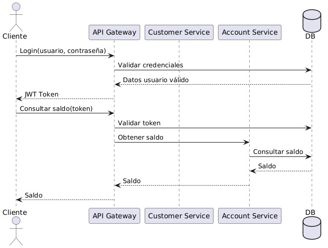

# Sistema Bancario - Arquitectura de Microservicios

Sistema bancario desarrollado con **Spring Boot** basado en arquitectura de microservicios que permite gestionar clientes y cuentas bancarias con operaciones de depósito, retiro y consultas.

## 🏗️ Arquitectura del Sistema

### Diagrama de Clases - Domain Models

### Diagrama de Componentes

### Diagrama de Secuencia

## 🏢 Microservicios

### 👤 Customer Microservice (puerto 8081)
- **Propósito**: Gestión completa de clientes
- **Base de datos**: `customer_db`
- **Funcionalidades**:
  - Registro de nuevos clientes
  - Consulta y listado de clientes
  - Actualización de datos del cliente
  - Eliminación de clientes (solo si no tienen cuentas activas)

### 💰 Account Microservice (puerto 8082)
- **Propósito**: Gestión de cuentas bancarias y operaciones
- **Base de datos**: `account_db`
- **Funcionalidades**:
  - Apertura de cuentas bancarias
  - Depósitos y retiros
  - Consulta de saldos
  - Listado de cuentas por cliente

## 💳 Tipos de Cuenta

- **SAVINGS** (Ahorros): 
  - Saldo mínimo: $0 (no permite saldo negativo)
  
- **CHECKING** (Corriente): 
  - Permite sobregiro hasta: -$500

## 🚀 API Endpoints

### 📖 Documentación Interactiva
- **Swagger Customer Service**: http://localhost:8081/swagger-ui.html
- **Swagger Account Service**: http://localhost:8082/swagger-ui.html

### 👤 Customer Service API (Puerto 8081)

| Método | Endpoint | Descripción |
|--------|----------|-------------|
| `POST` | `/api/v1/clients` | Registrar nuevo cliente |
| `GET` | `/api/v1/clients` | Obtener todos los clientes |
| `GET` | `/api/v1/clients/{id}` | Obtener cliente por ID |
| `PUT` | `/api/v1/clients/{id}` | Actualizar datos del cliente |
| `DELETE` | `/api/v1/clients/{id}` | Eliminar cliente |

### 💰 Account Service API (Puerto 8082)

| Método | Endpoint | Descripción |
|--------|----------|-------------|
| `POST` | `/api/v1/accounts` | Crear nueva cuenta bancaria |
| `GET` | `/api/v1/accounts` | Listar todas las cuentas |
| `GET` | `/api/v1/accounts/{id}` | Obtener cuenta por ID |
| `PUT` | `/api/v1/accounts/{id}/depositar` | Realizar depósito |
| `PUT` | `/api/v1/accounts/{id}/retirar` | Realizar retiro |
| `GET` | `/api/v1/accounts/clients/{clientId}` | Cuentas por cliente |
| `DELETE` | `/api/v1/accounts/{id}` | Eliminar cuenta |

## 🛠️ Tecnologías y Dependencias

- **Spring Boot 2.7.18** - Framework base
- **Java 11** - Versión de Java
- **Spring Data JPA** - Capa de persistencia
- **MySQL 8** - Base de datos relacional

## 🗄️ Base de Datos

### Esquema Principal
- **customer_db**: Base de datos del microservicio de clientes
  - Tabla: `clients` (información personal del cliente)
  
- **account_db**: Base de datos del microservicio de cuentas
  - Tabla: `bank_accounts` (cuentas bancarias y transacciones)

## 👥 Equipo de Desarrollo

**JavaPowerGirls Team**
- **Jessica Chanco**
- **Karen Duran Villa**
- **Tatiana Paucar**
