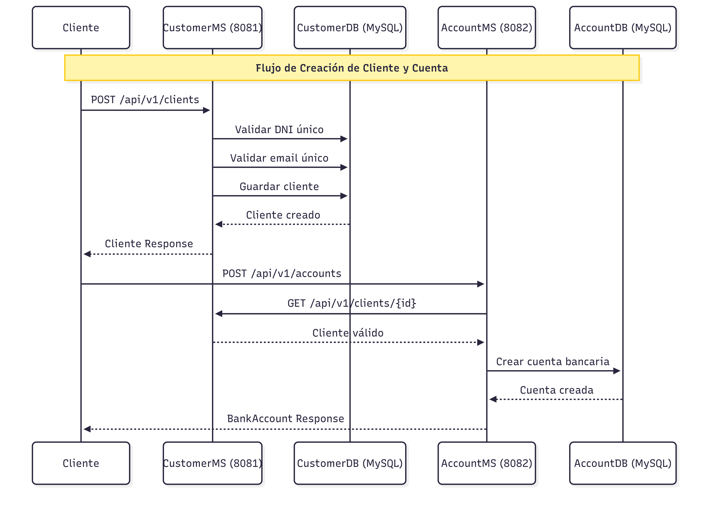

# Sistema Bancario - Microservicios

**Equipo:** [Jessica Chanco](https://github.com/qujessicax), [Karen Duran Villa](https://github.com/karenmelisa), [Tatiana Paucar](https://github.com/TMedalith)

---

## Índice

1. [Entregable II - CustomerMs y AccountMs](#entregable-ii---customerms-y-accountms)
2. [Entregable III - TransactionMs](#entregable-iii---transactionms)
3. [Diagramas de Arquitectura](#diagramas-de-arquitectura)
4. [Documentación OpenAPI](#documentación-openapi)
5. [Pruebas con Postman](#pruebas-con-postman)

---

## Entregable II - CustomerMs y AccountMs

**Tecnologías:** Spring Boot + MySQL + JPA/Hibernate + Java 11 (POO + Programación Funcional)

### Microservicios

**CustomerMs** (Puerto 8081)
- CRUD de clientes
- Base de datos: MySQL
- Ubicación: `./CustomerMs`

**AccountMs** (Puerto 8082)
- Gestión de cuentas bancarias
- Operaciones: depósito, retiro
- Base de datos: MySQL
- Ubicación: `./AccountMs`

### Endpoints

<table>
<tr>
<th>Método</th>
<th>Endpoint</th>
<th>Descripción</th>
</tr>
<tr>
<td colspan="3"><strong>CustomerMs (8081)</strong></td>
</tr>
<tr>
<td>POST</td>
<td>/api/v1/clients</td>
<td>Crear cliente</td>
</tr>
<tr>
<td>GET</td>
<td>/api/v1/clients</td>
<td>Listar clientes</td>
</tr>
<tr>
<td>GET</td>
<td>/api/v1/clients/{id}</td>
<td>Obtener cliente</td>
</tr>
<tr>
<td>PUT</td>
<td>/api/v1/clients/{id}</td>
<td>Actualizar cliente</td>
</tr>
<tr>
<td>DELETE</td>
<td>/api/v1/clients/{id}</td>
<td>Eliminar cliente</td>
</tr>
<tr>
<td colspan="3"><strong>AccountMs (8082)</strong></td>
</tr>
<tr>
<td>POST</td>
<td>/api/v1/accounts</td>
<td>Crear cuenta</td>
</tr>
<tr>
<td>GET</td>
<td>/api/v1/accounts</td>
<td>Listar cuentas</td>
</tr>
<tr>
<td>GET</td>
<td>/api/v1/accounts/{accountNumber}</td>
<td>Obtener cuenta</td>
</tr>
<tr>
<td>GET</td>
<td>/api/v1/accounts/clients/{clientId}</td>
<td>Cuentas por cliente</td>
</tr>
<tr>
<td>PUT</td>
<td>/api/v1/accounts/{accountNumber}/deposit</td>
<td>Realizar depósito</td>
</tr>
<tr>
<td>PUT</td>
<td>/api/v1/accounts/{accountNumber}/withdrawal</td>
<td>Realizar retiro</td>
</tr>
<tr>
<td>DELETE</td>
<td>/api/v1/accounts/{id}</td>
<td>Eliminar cuenta</td>
</tr>
</table>

---

## Entregable III - TransactionMs

**Tecnologías:** Spring Boot + Spring WebFlux + MongoDB + Lombok + Java 11 (Programación Reactiva)

### Microservicio

**TransactionMs** (Puerto 8083)
- Gestión de transacciones e historial
- Base de datos: MongoDB
- Programación reactiva con WebFlux
- Ubicación: `./TransactionMs`

### Endpoints

<table>
<tr>
<th>Método</th>
<th>Endpoint</th>
<th>Descripción</th>
</tr>
<tr>
<td>POST</td>
<td>/api/v1/transactions/accounts/{accountNumber}/deposit</td>
<td>Registrar depósito</td>
</tr>
<tr>
<td>POST</td>
<td>/api/v1/transactions/accounts/{accountNumber}/withdrawal</td>
<td>Registrar retiro</td>
</tr>
<tr>
<td>POST</td>
<td>/api/v1/transactions/accounts/transfer</td>
<td>Registrar transferencia</td>
</tr>
<tr>
<td>GET</td>
<td>/api/v1/transactions</td>
<td>Todas las transacciones</td>
</tr>
<tr>
<td>GET</td>
<td>/api/v1/transactions/accounts/{accountNumber}/history</td>
<td>Historial por cuenta</td>
</tr>
</table>

---

## Diagramas de Arquitectura

### Diagramas de Secuencia

### Diagrama de Componentes

### Diagrama General

---

## Documentación OpenAPI

**Contract-First:** Todas las APIs fueron diseñadas usando el enfoque contract-first, donde se define primero la especificación OpenAPI antes de implementar el código.

---

## Pruebas con Postman

**Documentación:** [Link de documentación Postman]